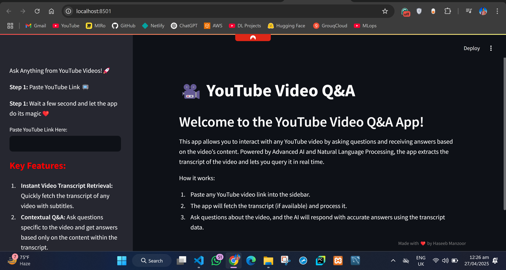
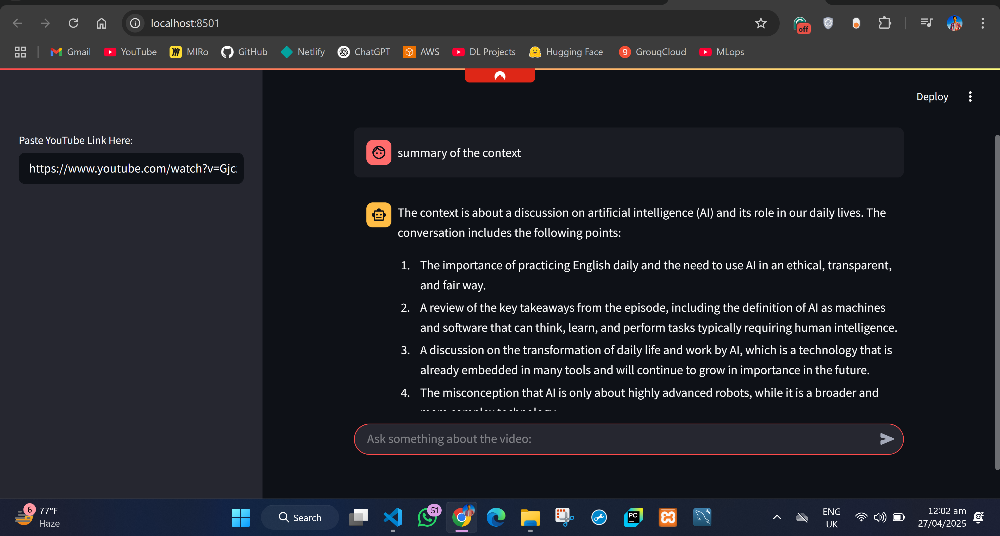

# YouTube Video Chatbot (RAG-Based)

## 🚀 Overview

This project builds a **Retrieval-Augmented Generation (RAG)**-based chatbot where users can **enter a YouTube video URL** and **chat with the video content**!

🔹 The app extracts the video transcript, creates a vector database using **FAISS** and **Sentence Transformers**, retrieves relevant parts based on your questions, and uses **Grok API** with **Llama-3.1-8b-instant** to generate accurate, context-based answers.

🔹 A clean **Streamlit frontend** lets you easily interact with the system.

---
**APP Homepage**

**AI Response**


## ✨ Features

- 🔍 Extracts YouTube video transcripts automatically.
- 🧠 Vector store creation using **FAISS** and **Sentence-Transformers** (`all-MiniLM-L6-v2`).
- 🧵 RAG Pipeline: Retrieve top-k relevant contexts and generate accurate answers.
- 🤖 Grok API integration with **Llama-3.1-8b-instant** model for high-quality responses.
- 🖥️ Streamlit-based frontend for easy interaction.
- ❓ Graceful handling if information is missing ("I don't know based on the given context").

---

## 🛠️ Tech Stack

| Layer            | Technology                                           |
|------------------|-------------------------------------------------------|
| Frontend         | Streamlit                                             |
| LLM (Model)      | Grok API - Llama-3.1-8b-instant                        |
| Embedding Model  | Sentence Transformers - all-MiniLM-L6-v2 (HuggingFace)|
| Vector Store     | FAISS                                                  |
| Transcript Fetch | YouTube Transcript API                                |
| Backend Framework| LangChain                                             |

---

## 📦 Installation

### 1. Clone the Repository
```bash
git clone https://github.com/Haseeb1511/RAG_Powered_YT_VIDEO_Q-A.git
```

### 2. Create a Virtual Environment (optional but recommended)
```bash
python -m venv venv
venv\Scripts\activate
```

### 3. Install Required Packages
```bash
pip install -r requirements.txt
```

### 4. Set Up Environment Variables
Create a `.env` file in the root directory with your API key:
```bash
GROQ_API_KEY=your_grok_api_key_here
```

---

## ⚙️ How it Works

1. **User inputs YouTube video URL** on the Streamlit app.
2. **Transcript is fetched** using the YouTube Transcript API.
3. **Embeddings are generated** for the transcript chunks using `all-MiniLM-L6-v2`.
4. **Embeddings are stored** in a FAISS vector store.
5. **When a user asks a question**:
   - The top-k most relevant transcript parts are retrieved.
   - These parts are fed into the **Llama-3.1-8b-instant** model (via Grok API) with a custom prompt.
   - The model **generates a final answer** based strictly on the retrieved context.

---

## ▶️ Running the App

After installing the dependencies and setting up the `.env`:

```bash
streamlit run app.py
```

The Streamlit server will start. Open the given URL in your browser (usually `http://localhost:8501`).

---

## 📂 Project Structure

```
yt-video-chatbot/
│
├── app.py                      # Main Streamlit app
├── model.py                    # LLM model, RAG pipeline, and QA chain setup
├── vector_store_generation.py  # Code to build FAISS vector store from transcripts
├── requirements.txt            # Python package dependencies
├── .env                        # Environment variables (Grok API key)
└── README.md                    # Project documentation
```

---

## 📜 Example Prompt Template

```text
You are a highly accurate assistant.
Use ONLY the given context to answer the user's question.
If the context does not contain the information needed, simply reply:
"I don't know based on the given context."

CONTEXT:
{context}

QUESTION:
{question}

Your Answer:
```

---

## ✅ Requirements

- Python 3.8+
- Streamlit
- LangChain
- Huggingface `sentence-transformers`
- FAISS
- Grok API access (for Llama-3.1-8b-instant)
- youtube-transcript-api

---

## 📈 Future Enhancements

- Handle long videos with transcript summarization.
- Support multiple videos for broader context.
- More robust error handling for unavailable transcripts.
- Add file upload (e.g., PDF) support.

---

## 🤝 Acknowledgements

- [Grok API](https://grok.x.ai/)
- [Sentence Transformers](https://www.sbert.net/)
- [LangChain](https://www.langchain.dev/)
- [FAISS by Facebook AI](https://github.com/facebookresearch/faiss)
- [Streamlit](https://streamlit.io/)

---

## 📄 License

This project is licensed under the [MIT License](LICENSE).

---

# 🔥 Start chatting with your favorite YouTube videos now!

